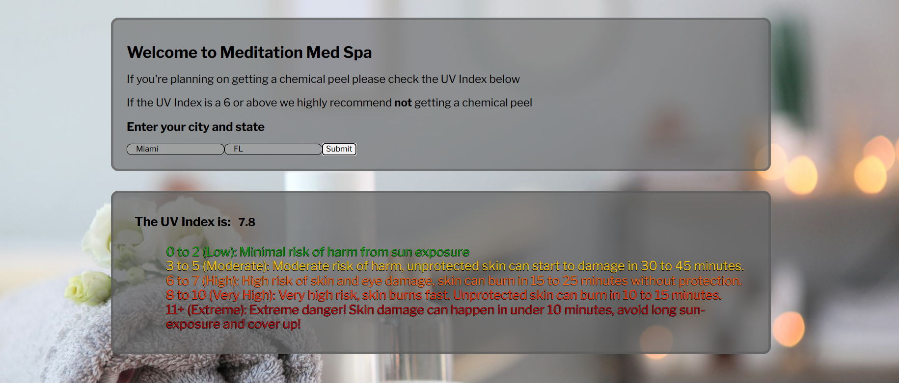

# Post-Treatment Sun Safety

A simple front-end web app for med spas and their clients. After treatments like chemical peels, laser treatments, or microneedling, skin is extra sensitive to the sun. Enter your city and the app shows the UV index forecast for the week ahead, so clients know which days to stay out of the sun and protect their results.

## Why It's Useful

Sun exposure after a treatment can cause irritation, dark spots, or poor healing, and it's one of the most common aftercare mistakes. Med spa staff can share this app during checkout or in aftercare instructions, so clients can plan around high-UV days instead of guessing.

## How It Works

This app chains two APIs together:

1. The user enters their **city or location**.
2. **Nominatim (OpenStreetMap)** turns that location into latitude and longitude.
3. Those coordinates are sent to **Open-Meteo**, which returns the daily maximum UV index for the next 7 days.
4. The forecast is displayed on the page day by day, so clients can see which days carry the highest sun risk.

## How It's Made

**Tech used:** HTML, CSS, JavaScript

**APIs:**
- [Nominatim](https://nominatim.org/): converts a place name to coordinates (no API key needed)
- [Open-Meteo](https://open-meteo.com/): provides the 7-day UV index forecast for those coordinates (no API key needed)

The page is built with HTML and styled with CSS. JavaScript uses `fetch()` to send the user's location to Nominatim, pulls the latitude and longitude out of the first result, and uses them to build a second request to Open-Meteo. The UV forecast that comes back is displayed in the DOM.